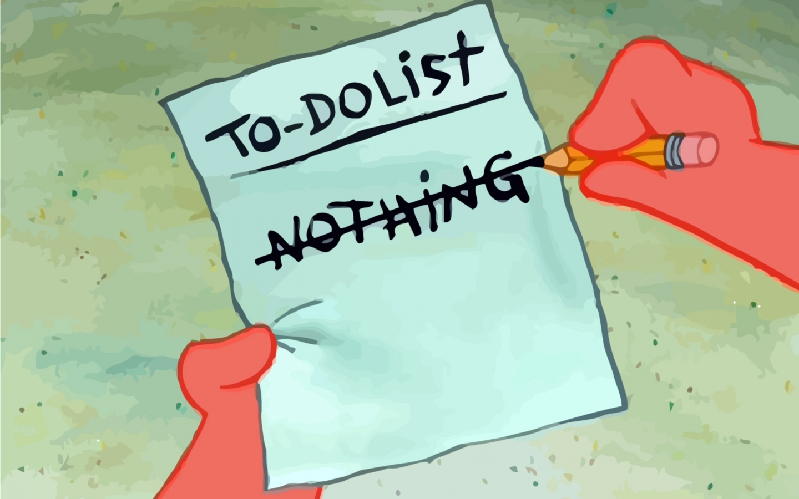

# Bikini Bottom Election - Part 2

## Review
In [Part 1](https://github.com/bitmakerlabs/bb-election-part-1) of this assignment, we looked at querying a JSON API with AJAX for some data about election candidates, and inserting them into the HTML with jQuery. Today, we'll continue where we left off and allow users to vote on candidates!

Because we're building off of Part 1, go ahead and copy your `index.html` and `election.js` files from Part 1 into this repo.

## Voting

Lets add some buttons that'll let us vote for a candidate.

We're gonna be making use of a second endpoint in our API to do this, `POST /vote`. This endpoint requires either an `id` or a `name` be given to it, so that it knows who the vote is going to.  We can insert this info either into the **query string** or the **body** of the request:
+ These two are equivalent:
  + **method:** `POST`, **url:** `https://bb-election-api.herokuapp.com/vote?id=577805c3e30089e66c1ede19`, **body:** `{}`
  + **method:** `POST`, **url:** `https://bb-election-api.herokuapp.com/vote`, **body:** `{"id" : "577805c3e30089e66c1ede19"}`
+ And these two are equivalent:
  + **method:** `POST`, **url:** `https://bb-election-api.herokuapp.com/vote?name=Gary`, **body:** `{}`
  + **method:** `POST`, **url:** `https://bb-election-api.herokuapp.com/vote`, **body:** `{"name" : "Gary"}`

If you want to see it in action, try sending some requests through one of the addons mentioned above.
+ If you receive a response with a `200` status, and message of `Ok`, it worked!
+ If you get a `400`, you left out `id` and `name`.
+ If you get a `404`, it means that there's no candidate matching the `id` or `name` you entered.
+ `500` means there's a server error of some kind. Either you encountered a bug, or something crashed on the server.

Alright, let's make it happen.

### Vote Synchronous

1. We're gonna create a small form for each of the candidates, inside of the `<li>` elements from **Part 1**. These forms will have to be created with jQuery after your first load of the candidates completes. This is because the candidates won't be populated until this request completes:
  + Start by just adding an empty `<form></form>` to the end of each `<li>`, and make sure that they're being created okay when the page loads.
  + Next, let's make these forms do something when we submit them. We want to make a `POST` request to `https://bb-election-api.herokuapp.com/vote`, so let's make the form's `method="POST"`, and the `action="https://bb-election-api.herokuapp.com/vote"`
1. Each of these little forms will contain two things: a **submit button**, which we'll use to vote for that particular candidate, and a **hidden field**. Here you have an option. Remember that in order to vote for a particular candidate, we have to tell the API which candidate we'd like to vote for, so we need to include either the **name**, or the **id** of the candidate. This is what we'll use our hidden field for.
  + If you decide to go with **id**, your hidden field needs to have a `name="id"`, and a `value=` to the id of the appropriate candidate
  + If you decide to go with **name**, your hidden field needs to have a `name="name"`, and a `value=` to the name of the appropriate candidate
1. What we have so far should work synchronously: if we click the button for a particular candidate, it should navigate us to a new page with a `200 OK` response, meaning our vote went through. This is great! However, we want to make the page update asynchronously. Which means we need to **bind an event** to the form submission, stop the submission from going through, and then construct an AJAX request instead.

### Vote Asynchronously

1. Create a `submit` event handler for these forms, and be sure to make use of `preventDefault()` to stop our form from submitting synchronously. A couple tips:
  + Remember that your page doesn't have these forms until after your first load of the candidates, so you can't define your submit handler until this request completes. If you try to define your submit handler on page load, it won't work.
  + You should only need one event handler for every form, you won't need a seperate handler for each form.
1. Construct a `POST` request to `https://bb-election-api.herokuapp.com/vote`:
  + This request should be made whenever the `submit` event from one of our vote buttons is fired.
  + Get the `name` or `id` from the hidden field we set up earlier. You can make use of `$(this).children('input[type=hidden]').val()` to get the value of the hidden field for whichever form the event was fired for. Try using `console.log` to see this in action!
  + Put the `name` or `id` in either the **query string** or the **body** of the `POST` request we're making. Try both!
  + Once we click the submit button, and our `POST` request is sent, make sure that we're receiving a `200` (a success) status code in response to our AJAX request. You'll need to chain another function to your AJAX request in addition to `.done`, called `.fail`. `.done` is triggered when the request completes successfully, `.fail` when it does not. If you're getting back a different status code, something isn't quite right with your request, review the codes listed out above.
1. Now that we can vote, add a **"Refresh"** button or link to the `index.html` file. Create a `click` event handler for this button in `election.js`. When it's clicked, update the vote counts of the various candidates. You'll have to update the existing `<li>` elements now instead of appending.
1. **STRETCH:**
  + Update the vote counts after a vote
  + Disable the vote buttons after a vote (it's fine if they reenable after refresh)

## We're done!

Congratulations, you've helped bring Bikini Bottom into the 21st century. A winner is you!

